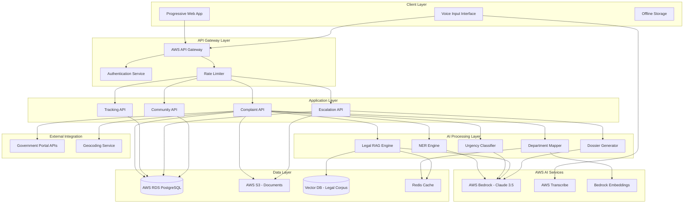

# Design Document: ECHO – AI-Powered Civic Grievance Intelligence Platform

## 1. Overview

ECHO is an AI-native civic accountability platform that transforms the citizen grievance filing process from a bureaucratic obstacle course into an intelligent, guided, and transparent system. The platform addresses the fundamental disconnect between how citizens communicate (informal, multilingual, voice-based) and how government systems expect input (formal, structured, text-based).

### 1.1 Design Philosophy

The design follows three core principles:

1. **AI-First Architecture**: Every component leverages AI to reduce citizen burden—NLP for interpretation, semantic search for department mapping, RAG for legal guidance, and generative AI for escalation documents.

2. **Progressive Enhancement**: The system works offline for basic complaint drafting, enhances with AI when online, and integrates with government systems when APIs are available.

3. **Citizen-Centric Flow**: The architecture optimizes for citizen experience, not government convenience—accepting informal input, providing proactive guidance, and automating complex tasks.

### 1.2 Key Design Decisions

**AWS Bedrock for AI Inference**: Using Claude 3.5 Sonnet via AWS Bedrock provides production-grade AI capabilities without managing model infrastructure. Bedrock handles scaling, versioning, and compliance.

**RAG Over Fine-Tuning for Legal References**: Legal corpus changes frequently with new laws and amendments. RAG enables real-time retrieval without expensive model retraining.

**Progressive Web App Architecture**: PWA provides offline capability, mobile-first experience, and cross-platform compatibility without separate native apps.

**Event-Driven Processing**: Asynchronous processing of AI tasks (NER, department mapping, legal retrieval) prevents blocking and enables horizontal scaling.

**Immutable Audit Trail**: Every action is logged to an append-only audit store, ensuring transparency and enabling escalation documentation.


## 2. Architecture

### 2.1 System Architecture Diagram



### 2.2 Architecture Layers

**Client Layer**: Progressive Web App with offline-first capability, voice input interface, and local storage for draft complaints.

**API Gateway Layer**: AWS API Gateway handles routing, authentication via JWT tokens, rate limiting (5 requests/second per user), and request validation.

**Application Layer**: RESTful APIs for complaint submission, tracking, escalation, and community features. Each API is a separate Lambda function for independent scaling.

**AI Processing Layer**: Specialized engines for NER, classification, department mapping, legal retrieval, and dossier generation. Each engine is a Lambda function that calls AWS Bedrock or other AI services.

**AWS AI Services**: AWS Bedrock provides Claude 3.5 Sonnet for NLP tasks and text embeddings for semantic search. AWS Transcribe handles voice-to-text conversion.

**Data Layer**: PostgreSQL on RDS for structured data, S3 for documents and audio files, vector database (pgvector extension in PostgreSQL) for legal corpus embeddings, Redis for caching frequent queries.

**External Integration**: Optional integration with government portal APIs and geocoding services for address validation.

### 2.3 Data Flow

**Complaint Submission Flow**:
1. Citizen submits complaint via PWA (text or voice)
2. If voice, AWS Transcribe converts to text
3. Complaint API stores raw input in RDS
4. NER Engine extracts entities (who, what, where, when)
5. Urgency Classifier assigns priority level
6. Department Mapper identifies responsible department
7. Legal RAG Engine retrieves applicable laws
8. Structured complaint with metadata stored in RDS
9. Response returned to citizen with department, urgency, and legal references

**Escalation Flow**:
1. Citizen requests escalation for unresolved complaint
2. Escalation API retrieves complaint history from RDS
3. Dossier Generator calls Claude 3.5 to synthesize:
   - Complaint summary
   - Complete timeline
   - Legal references
   - Evidence list
   - RTI questions
4. PDF generated and stored in S3
5. Download link returned to citizen

**Community Polling Flow**:
1. Community API receives request for similar complaints
2. Complaint embeddings retrieved from vector database
3. Semantic similarity search finds related complaints
4. Aggregated statistics computed with anonymization
5. Results returned to citizen

### 2.4 End-to-End Sequence Flow (Citizen-to-Resolution)

This section provides a complete walkthrough of the citizen grievance journey from initial submission to escalation, highlighting how AI components work together to transform unstructured input into actionable, legally-grounded documentation.

**Step-by-Step Workflow**:

1. **Citizen Submits Complaint**: Citizen opens PWA and submits complaint via text input or voice recording (e.g., "Road pe bahut bade potholes hain near Sector 12 market")

2. **API Gateway Validation**: Request passes through API Gateway, which validates authentication (JWT token), enforces rate limits (5 complaints/hour), and routes to Complaint API Lambda

3. **Voice Transcription** (if applicable): If voice input, AWS Transcribe converts audio to text with Hindi/English/Hinglish support

4. **Raw Complaint Storage**: Complaint API stores raw complaint text in PostgreSQL with status "draft" and generates unique complaint ID

5. **NER Processing**: NER Engine calls AWS Bedrock (Claude 3.5 Sonnet) to extract structured entities:
   - **Who**: Parties involved (complainant, officials)
   - **What**: Issue type (potholes, infrastructure)
   - **Where**: Location (Sector 12 market, Noida)
   - **When**: Temporal information (last 2 weeks)

6. **Urgency Classification**: Urgency Classifier analyzes complaint text for emergency keywords and context, assigns urgency level (Low/Medium/High/Critical) with confidence score

7. **Department Mapping**: Department Mapper performs semantic matching:
   - Generates embedding for complaint using AWS Bedrock Embeddings
   - Performs vector similarity search against department database (pgvector)
   - Identifies primary department (e.g., Public Works Department) with confidence score
   - Returns alternative departments ranked by relevance

8. **Jurisdiction Determination**: Based on complaint location (Sector 12, Noida), system determines applicable jurisdiction (Noida Municipal Corporation)

9. **Legal RAG Retrieval**: Legal Rights Engine queries legal knowledge base:
   - Generates embedding for complaint
   - Performs vector similarity search in legal corpus (pgvector)
   - Retrieves top-K relevant laws (e.g., Municipal Corporation Act Section 123)
   - Claude 3.5 generates plain-language summaries of legal provisions
   - Returns legal references with source citations

10. **Evidence Suggestion**: Evidence Suggestion Engine analyzes complaint category (infrastructure) and recommends evidence types:
    - Geotagged photographs showing potholes
    - Video showing extent of damage
    - Measurements of pothole size/depth

11. **Filing Guidance**: System retrieves official filing procedure for identified department, including required forms and step-by-step instructions

12. **Structured Complaint Storage**: Complete structured complaint stored in PostgreSQL with:
    - Extracted entities
    - Department mapping results
    - Urgency classification
    - Legal references
    - Evidence suggestions
    - Status updated to "submitted"

13. **Response to Citizen**: API returns comprehensive response to PWA:
    - Complaint ID for tracking
    - Identified department and jurisdiction
    - Urgency level
    - Applicable laws with summaries
    - Evidence collection guidance
    - Filing procedure steps

14. **Audit Logging**: Every action logged to immutable audit trail with timestamp, actor, and details

15. **Status Tracking**: Citizen can query complaint status anytime; system tracks time elapsed since submission

16. **Escalation Trigger**: After configurable period without resolution (30 days for non-critical, 7 days for critical), system flags complaint as eligible for escalation

17. **Escalation Request**: Citizen requests escalation dossier generation

18. **Dossier Generation**: Dossier Generator calls Claude 3.5 Sonnet to synthesize:
    - Executive summary of complaint
    - Complete timeline from audit trail
    - All legal references with citations
    - Evidence submitted and recommended
    - Pre-drafted RTI questions
    - Escalation authority contact information

19. **PDF Generation**: System generates professionally formatted PDF and stores in S3

20. **Dossier Download**: Citizen downloads escalation dossier for submission to higher authorities

21. **Audit Logging**: Dossier generation event logged to audit trail

**Simplified Sequence Diagram**:

```
Citizen
  |
  | (1) Submit complaint (text/voice)
  v
PWA (Progressive Web App)
  |
  | (2) HTTPS POST /complaints
  v
API Gateway
  |
  | (3) Validate JWT, Rate Limit
  v
Complaint API (Lambda)
  |
  |---(4) Store raw complaint---> PostgreSQL
  |
  |---(5) Extract entities-----> NER Engine (Lambda)
  |                                    |
  |                                    v
  |                              AWS Bedrock (Claude 3.5)
  |
  |---(6) Classify urgency----> Urgency Classifier (Lambda)
  |                                    |
  |                                    v
  |                              AWS Bedrock (Claude 3.5)
  |
  |---(7) Map department------> Department Mapper (Lambda)
  |                                    |
  |                                    |---> AWS Bedrock Embeddings
  |                                    |
  |                                    v
  |                              Vector Search (pgvector)
  |
  |---(8) Retrieve laws-------> Legal RAG Engine (Lambda)
  |                                    |
  |                                    |---> AWS Bedrock Embeddings
  |                                    |
  |                                    |---> Vector Search (pgvector)
  |                                    |
  |                                    v
  |                              AWS Bedrock (Claude 3.5) for summaries
  |
  |---(9) Suggest evidence----> Evidence Engine (Lambda)
  |
  |---(10) Store structured---> PostgreSQL
  |
  |---(11) Log audit event----> PostgreSQL (audit_events table)
  |
  | (12) Return response
  v
Citizen (receives department, urgency, laws, evidence guidance)

[Later: Escalation Flow]

Citizen
  |
  | (13) Request escalation dossier
  v
Escalation API (Lambda)
  |
  |---(14) Retrieve complaint history---> PostgreSQL
  |
  |---(15) Generate dossier-------------> Dossier Generator (Lambda)
  |                                             |
  |                                             v
  |                                       AWS Bedrock (Claude 3.5)
  |
  |---(16) Generate PDF------------------> PDF Library
  |
  |---(17) Store PDF--------------------> AWS S3
  |
  |---(18) Log audit event--------------> PostgreSQL
  |
  | (19) Return download URL
  v
Citizen (downloads escalation dossier PDF)
```

**Key Observations**:
- **AI at Every Step**: NER, classification, mapping, and legal retrieval all leverage AWS Bedrock for intelligent processing
- **Asynchronous Processing**: AI tasks run in parallel where possible (NER, urgency, department mapping can run concurrently)
- **Immutable Audit Trail**: Every action logged for transparency and escalation documentation
- **Citizen-Centric**: Complex AI processing hidden behind simple interface; citizen receives actionable guidance
- **Scalable Architecture**: Lambda functions scale independently based on load; vector search optimized with caching


## 3. Components and Interfaces

### 3.1 Complaint Intake Service

**Responsibility**: Accept and validate citizen complaints in text or voice format.

**Interface**:
```typescript
interface ComplaintIntakeService {
  // Submit text complaint
  submitTextComplaint(request: TextComplaintRequest): Promise<ComplaintResponse>
  
  // Submit voice complaint
  submitVoiceComplaint(request: VoiceComplaintRequest): Promise<ComplaintResponse>
  
  // Validate complaint input
  validateComplaint(complaint: string): ValidationResult
}

interface TextComplaintRequest {
  userId: string
  complaintText: string
  location?: LocationData
  attachments?: Attachment[]
  preferredLanguage: Language
}

interface VoiceComplaintRequest {
  userId: string
  audioFile: AudioFile
  location?: LocationData
  preferredLanguage: Language
}

interface ComplaintResponse {
  complaintId: string
  status: ComplaintStatus
  extractedEntities: ExtractedEntities
  suggestedDepartment: Department
  urgencyLevel: UrgencyLevel
  legalReferences: LegalReference[]
  evidenceSuggestions: string[]
}

interface ValidationResult {
  isValid: boolean
  errors: string[]
}
```

**Implementation Notes**:
- Text complaints validated for non-empty content (reject whitespace-only)
- Voice complaints transcribed via AWS Transcribe with Hindi/English/Hinglish support
- Maximum complaint length: 5000 characters
- Maximum audio duration: 5 minutes
- Attachments stored in S3 with virus scanning

### 3.2 NER Engine

**Responsibility**: Extract structured entities from unstructured complaint text.

**Interface**:
```typescript
interface NEREngine {
  // Extract entities from complaint text
  extractEntities(text: string, language: Language): Promise<ExtractedEntities>
  
  // Get confidence scores for extracted entities
  getConfidenceScores(entities: ExtractedEntities): ConfidenceScores
}

interface ExtractedEntities {
  who: Person[]        // People involved (complainant, officials, etc.)
  what: Issue[]        // Issue type and description
  where: Location[]    // Geographic locations mentioned
  when: Temporal[]     // Dates, times, durations
  rawText: string      // Original complaint text
}

interface Person {
  name?: string
  role?: string        // e.g., "municipal officer", "neighbor"
  confidence: number
}

interface Issue {
  category: string     // e.g., "infrastructure", "sanitation"
  description: string
  keywords: string[]
  confidence: number
}

interface Location {
  address?: string
  landmark?: string
  coordinates?: {lat: number, lon: number}
  confidence: number
}

interface Temporal {
  type: string         // e.g., "incident_date", "duration"
  value: string
  normalized?: Date
  confidence: number
}

interface ConfidenceScores {
  overall: number
  byEntity: Map<string, number>
}
```

**Implementation Notes**:
- Uses Claude 3.5 Sonnet via AWS Bedrock with custom prompt for entity extraction
- Prompt includes examples of Hinglish text and expected entity extraction
- Confidence threshold: 75% for entity acceptance
- Low confidence entities flagged for citizen review
- Target accuracy: 85% F1 score on entity extraction

### 3.3 Urgency Classifier

**Responsibility**: Analyze complaint content to determine urgency level.

**Interface**:
```typescript
interface UrgencyClassifier {
  // Classify complaint urgency
  classifyUrgency(complaint: string, entities: ExtractedEntities): Promise<UrgencyResult>
}

interface UrgencyResult {
  level: UrgencyLevel
  confidence: number
  reasoning: string[]  // Keywords/phrases that influenced classification
}

enum UrgencyLevel {
  LOW = "low",
  MEDIUM = "medium",
  HIGH = "high",
  CRITICAL = "critical"
}
```

**Implementation Notes**:
- Uses Claude 3.5 Sonnet with urgency classification prompt
- Critical keywords: "emergency", "danger", "health risk", "accident", "fire", "flood"
- High keywords: "urgent", "immediate", "serious", "multiple days"
- Considers temporal context (e.g., "stopped for 2 weeks" vs "stopped today")
- Target accuracy: 80% on urgency classification
- Minimizes false negatives for critical complaints

### 3.4 Department Mapper

**Responsibility**: Map complaints to appropriate government departments using semantic matching.

**Interface**:
```typescript
interface DepartmentMapper {
  // Map complaint to department
  mapToDepartment(complaint: string, entities: ExtractedEntities, location: Location): Promise<DepartmentMapping>
  
  // Get alternative department suggestions
  getAlternativeDepartments(complaintId: string, topK: number): Promise<Department[]>
}

interface DepartmentMapping {
  primaryDepartment: Department
  confidence: number
  alternativeDepartments: Department[]
  reasoning: string
}

interface Department {
  id: string
  name: string
  jurisdiction: Jurisdiction
  contactInfo: ContactInfo
  filingProcedure: FilingProcedure
  relevanceScore: number
}

interface Jurisdiction {
  type: string         // e.g., "municipal", "state", "central"
  geographicBounds: GeographicBounds
  populationServed?: number
}

interface ContactInfo {
  email?: string
  phone?: string
  address?: string
  website?: string
  officerName?: string
}

interface FilingProcedure {
  steps: string[]
  requiredForms: Form[]
  expectedTimeline: string
  escalationAuthority?: string
}
```

**Implementation Notes**:
- Uses AWS Bedrock embeddings to create vector representations of complaints
- Department database includes descriptions and keywords embedded in same vector space
- Cosine similarity search finds most relevant departments
- Confidence threshold: 70% for automatic mapping
- Below threshold: prompt citizen to review and confirm
- Caches department embeddings in Redis for performance
- Target accuracy: 90% on primary department identification


### 3.5 Legal RAG Engine

**Responsibility**: Retrieve relevant legal references using Retrieval-Augmented Generation.

**Interface**:
```typescript
interface LegalRAGEngine {
  // Retrieve relevant legal references
  retrieveLegalReferences(complaint: string, department: Department, topK: number): Promise<LegalReference[]>
  
  // Get plain language explanation of a legal provision
  explainLegalProvision(reference: LegalReference): Promise<string>
  
  // Generate RTI questions based on complaint
  generateRTIQuestions(complaint: string, legalRefs: LegalReference[]): Promise<string[]>
}

interface LegalReference {
  actName: string
  section: string
  clause?: string
  text: string
  summary: string          // Plain language explanation
  sourceUrl: string        // Official government source
  relevanceScore: number
  applicableRights: string[]
}
```

**Implementation Notes**:
- Legal corpus stored as embeddings in pgvector (PostgreSQL extension)
- Corpus includes: RTI Act, Municipal Corporation Acts, Consumer Protection Act, Environmental Protection Act, state-specific laws
- Retrieval process:
  1. Embed complaint text using AWS Bedrock embeddings
  2. Vector similarity search in legal corpus
  3. Retrieve top-K most relevant legal provisions
  4. Use Claude 3.5 to generate plain language summaries
- Relevance threshold: 60% for inclusion in results
- Caches frequent legal queries in Redis
- Legal corpus updated quarterly with new laws and amendments
- Target: Relevant law in top 5 results for 90% of queries

### 3.6 Evidence Suggestion Engine

**Responsibility**: Recommend evidence types based on complaint category.

**Interface**:
```typescript
interface EvidenceSuggestionEngine {
  // Generate evidence suggestions
  suggestEvidence(complaint: string, category: string, department: Department): Promise<EvidenceSuggestion[]>
}

interface EvidenceSuggestion {
  type: EvidenceType
  description: string
  collectionInstructions: string
  isMandatory: boolean
  examples: string[]
}

enum EvidenceType {
  PHOTOGRAPH = "photograph",
  VIDEO = "video",
  DOCUMENT = "document",
  WITNESS_STATEMENT = "witness_statement",
  OFFICIAL_CORRESPONDENCE = "official_correspondence",
  RECEIPT = "receipt",
  MEDICAL_RECORD = "medical_record"
}
```

**Implementation Notes**:
- Rule-based system with category-specific evidence templates
- Infrastructure complaints: geotagged photos, timestamps
- Health complaints: medical records, test reports
- Financial complaints: receipts, transaction records
- Pollution complaints: photos, videos, witness statements
- Recommendations include collection instructions (e.g., "Take photo showing full context with visible landmarks")

### 3.7 Escalation Dossier Generator

**Responsibility**: Generate comprehensive escalation documents using AI.

**Interface**:
```typescript
interface EscalationDossierGenerator {
  // Generate escalation dossier
  generateDossier(complaintId: string): Promise<DossierResult>
  
  // Preview dossier content before generation
  previewDossier(complaintId: string): Promise<DossierPreview>
}

interface DossierResult {
  dossierUrl: string       // S3 URL for PDF download
  generatedAt: Date
  sections: DossierSection[]
}

interface DossierPreview {
  complaintSummary: string
  timeline: TimelineEvent[]
  legalReferences: LegalReference[]
  evidenceList: string[]
  rtiQuestions: string[]
  escalationAuthority: ContactInfo
}

interface DossierSection {
  title: string
  content: string
  order: number
}

interface TimelineEvent {
  date: Date
  event: string
  actor: string
  evidence?: string
}
```

**Implementation Notes**:
- Uses Claude 3.5 Sonnet to synthesize all complaint data into professional document
- Dossier structure:
  1. Executive Summary
  2. Complaint Details (who, what, where, when)
  3. Complete Timeline of Actions
  4. Legal Rights and Applicable Laws
  5. Evidence Submitted
  6. Recommended Evidence (if not yet submitted)
  7. Pre-drafted RTI Questions
  8. Escalation Authority Contact Information
  9. Citizen Declaration and Signature Section
- PDF generated using HTML-to-PDF library with professional formatting
- Stored in S3 with 7-year retention for audit compliance
- Generation time target: < 10 seconds

### 3.8 Community Polling Service

**Responsibility**: Identify and aggregate similar complaints for systemic issue detection.

**Interface**:
```typescript
interface CommunityPollingService {
  // Find similar complaints
  findSimilarComplaints(complaintId: string, radius: number, topK: number): Promise<SimilarComplaint[]>
  
  // Get aggregate statistics for a complaint type
  getAggregateStats(category: string, location: Location, timeRange: TimeRange): Promise<AggregateStats>
  
  // Identify systemic issues
  identifySystemicIssues(location: Location, threshold: number): Promise<SystemicIssue[]>
}

interface SimilarComplaint {
  complaintId: string
  similarity: number
  category: string
  location: Location
  status: ComplaintStatus
  filedDate: Date
  // Personal details excluded for privacy
}

interface AggregateStats {
  totalComplaints: number
  unresolvedCount: number
  averageResolutionTime: number
  commonKeywords: string[]
  geographicDistribution: Map<string, number>
}

interface SystemicIssue {
  issueType: string
  affectedArea: string
  complaintCount: number
  firstReportedDate: Date
  resolutionRate: number
  severity: string
}
```

**Implementation Notes**:
- Uses complaint embeddings for semantic similarity search
- Similarity threshold: 0.75 for "similar complaint" classification
- Anonymization: k-anonymity with k=5 (only show stats when ≥5 similar complaints)
- Geographic clustering using location data
- Systemic issue threshold: 10+ similar unresolved complaints in same area within 90 days
- Privacy-preserving: no individual complaint text or citizen identifiers exposed

### 3.9 Complaint Tracking Service

**Responsibility**: Manage complaint lifecycle and status updates.

**Interface**:
```typescript
interface ComplaintTrackingService {
  // Get complaint status
  getComplaintStatus(complaintId: string): Promise<ComplaintStatus>
  
  // Get complete audit trail
  getAuditTrail(complaintId: string): Promise<AuditEvent[]>
  
  // Update complaint status
  updateStatus(complaintId: string, newStatus: ComplaintStatus, actor: string, notes: string): Promise<void>
  
  // Check if complaint is eligible for escalation
  isEligibleForEscalation(complaintId: string): Promise<EscalationEligibility>
}

interface ComplaintStatus {
  current: StatusType
  lastUpdated: Date
  updatedBy: string
  notes?: string
}

enum StatusType {
  DRAFT = "draft",
  SUBMITTED = "submitted",
  UNDER_REVIEW = "under_review",
  IN_PROGRESS = "in_progress",
  RESOLVED = "resolved",
  REJECTED = "rejected",
  ESCALATED = "escalated"
}

interface AuditEvent {
  timestamp: Date
  eventType: string
  actor: string
  details: string
  metadata?: Record<string, any>
}

interface EscalationEligibility {
  isEligible: boolean
  reason: string
  daysSinceSubmission: number
  requiredWaitingPeriod: number
}
```

**Implementation Notes**:
- Audit trail stored in append-only table for immutability
- Every action logged: submission, status changes, escalation, dossier generation
- Escalation eligibility: 30 days without resolution for non-critical, 7 days for critical
- Status updates trigger notifications to citizen (email/SMS)
- Audit trail included in escalation dossiers


### 3.10 Authentication and Authorization Service

**Responsibility**: Manage user authentication and access control.

**Interface**:
```typescript
interface AuthService {
  // Register new user
  register(request: RegistrationRequest): Promise<AuthResult>
  
  // Authenticate user
  login(credentials: LoginCredentials): Promise<AuthResult>
  
  // Verify JWT token
  verifyToken(token: string): Promise<TokenPayload>
  
  // Refresh access token
  refreshToken(refreshToken: string): Promise<AuthResult>
  
  // Logout user
  logout(userId: string): Promise<void>
}

interface RegistrationRequest {
  phone: string
  email?: string
  name: string
  preferredLanguage: Language
  otpCode: string          // Phone verification OTP
}

interface LoginCredentials {
  phone: string
  otpCode: string          // OTP-based authentication
}

interface AuthResult {
  accessToken: string
  refreshToken: string
  expiresIn: number
  user: UserProfile
}

interface TokenPayload {
  userId: string
  phone: string
  roles: string[]
  issuedAt: Date
  expiresAt: Date
}

interface UserProfile {
  userId: string
  phone: string
  email?: string
  name: string
  preferredLanguage: Language
  createdAt: Date
}
```

**Implementation Notes**:
- OTP-based authentication (no passwords) for accessibility
- JWT tokens with 1-hour expiration, refresh tokens with 30-day expiration
- Rate limiting: 5 OTP requests per hour per phone number
- Phone verification required for account creation
- Tokens stored in Redis with automatic expiration
- RBAC support for future admin/moderator roles


## 4. Data Models

### 4.1 Complaint Entity

```typescript
interface Complaint {
  // Identity
  complaintId: string              // UUID
  userId: string                   // Foreign key to User
  
  // Input
  rawText: string                  // Original complaint text
  language: Language
  inputMethod: InputMethod         // TEXT or VOICE
  audioFileUrl?: string            // S3 URL if voice input
  
  // Extracted Information
  entities: ExtractedEntities
  structuredDescription: string    // AI-generated structured version
  
  // Classification
  category: string                 // e.g., "infrastructure", "sanitation"
  urgencyLevel: UrgencyLevel
  urgencyConfidence: number
  
  // Department Mapping
  primaryDepartment: string        // Department ID
  departmentConfidence: number
  alternativeDepartments: string[] // Department IDs
  jurisdiction: string             // Jurisdiction ID
  
  // Location
  location: LocationData
  
  // Legal References
  legalReferences: string[]        // Legal reference IDs
  
  // Evidence
  attachments: Attachment[]
  suggestedEvidence: string[]
  
  // Status
  status: StatusType
  statusHistory: StatusChange[]
  
  // Escalation
  isEscalated: boolean
  escalationDate?: Date
  escalationDossierUrl?: string
  
  // Metadata
  createdAt: Date
  updatedAt: Date
  submittedAt?: Date
  resolvedAt?: Date
  
  // External Integration
  externalReferenceId?: string     // ID from government portal if forwarded
}

interface LocationData {
  address?: string
  landmark?: string
  city: string
  state: string
  pincode?: string
  coordinates?: {
    latitude: number
    longitude: number
  }
}

interface Attachment {
  attachmentId: string
  fileName: string
  fileType: string
  fileSize: number
  s3Url: string
  uploadedAt: Date
  description?: string
}

interface StatusChange {
  fromStatus: StatusType
  toStatus: StatusType
  changedAt: Date
  changedBy: string
  notes?: string
}

enum InputMethod {
  TEXT = "text",
  VOICE = "voice"
}

enum Language {
  ENGLISH = "en",
  HINDI = "hi",
  HINGLISH = "hi-en"
}
```

### 4.2 User Entity

```typescript
interface User {
  userId: string                   // UUID
  phone: string                    // Unique, indexed
  email?: string
  name: string
  preferredLanguage: Language
  
  // Authentication
  phoneVerified: boolean
  emailVerified: boolean
  
  // Profile
  address?: string
  city?: string
  state?: string
  
  // Activity
  complaintCount: number
  lastLoginAt?: Date
  createdAt: Date
  updatedAt: Date
  
  // Preferences
  notificationPreferences: NotificationPreferences
}

interface NotificationPreferences {
  emailNotifications: boolean
  smsNotifications: boolean
  statusUpdates: boolean
  escalationReminders: boolean
}
```

### 4.3 Department Entity

```typescript
interface DepartmentEntity {
  departmentId: string             // UUID
  name: string
  nameHindi?: string
  description: string
  keywords: string[]               // For semantic matching
  embedding: number[]              // Vector embedding for similarity search
  
  // Hierarchy
  parentDepartmentId?: string
  level: DepartmentLevel           // MUNICIPAL, STATE, CENTRAL
  
  // Jurisdiction
  jurisdiction: JurisdictionData
  
  // Contact
  contactInfo: ContactInfo
  
  // Filing
  filingProcedure: FilingProcedure
  requiredForms: Form[]
  expectedResponseTime: number     // Days
  
  // Escalation
  escalationAuthority?: ContactInfo
  escalationThreshold: number      // Days before escalation eligible
  
  // Metadata
  isActive: boolean
  createdAt: Date
  updatedAt: Date
}

interface JurisdictionData {
  type: string                     // e.g., "municipal", "state", "central"
  geographicBounds?: GeoJSON       // Polygon defining jurisdiction
  cities: string[]
  states: string[]
  pincodes: string[]
}

interface Form {
  formId: string
  formName: string
  formUrl: string
  description: string
  isMandatory: boolean
}

enum DepartmentLevel {
  MUNICIPAL = "municipal",
  STATE = "state",
  CENTRAL = "central"
}
```

### 4.4 Legal Reference Entity

```typescript
interface LegalReferenceEntity {
  referenceId: string              // UUID
  actName: string
  actYear: number
  section: string
  clause?: string
  subsection?: string
  
  // Content
  fullText: string
  summary: string                  // Plain language explanation
  keywords: string[]
  embedding: number[]              // Vector embedding for RAG
  
  // Metadata
  sourceUrl: string                // Official government source
  jurisdiction: string             // CENTRAL, STATE, or state name
  category: string[]               // e.g., ["infrastructure", "environment"]
  applicableRights: string[]
  
  // Versioning
  effectiveFrom: Date
  effectiveTo?: Date               // Null if currently active
  amendmentHistory: Amendment[]
  
  // Usage
  citationCount: number            // How often retrieved
  lastCitedAt?: Date
  
  createdAt: Date
  updatedAt: Date
}

interface Amendment {
  amendmentDate: Date
  amendmentAct: string
  description: string
  sourceUrl: string
}
```

### 4.5 Audit Trail Entity

```typescript
interface AuditEvent {
  eventId: string                  // UUID
  complaintId: string              // Foreign key
  
  // Event Details
  eventType: AuditEventType
  timestamp: Date
  actor: string                    // User ID or "SYSTEM"
  actorType: ActorType
  
  // Event Data
  description: string
  metadata: Record<string, any>    // Flexible JSON for event-specific data
  
  // AI Decision Tracking
  aiModel?: string                 // e.g., "claude-3.5-sonnet"
  aiConfidence?: number
  aiReasoning?: string
  
  // Immutability
  previousEventId?: string         // Linked list for integrity
  checksum: string                 // Hash of event data
}

enum AuditEventType {
  COMPLAINT_CREATED = "complaint_created",
  COMPLAINT_SUBMITTED = "complaint_submitted",
  ENTITY_EXTRACTED = "entity_extracted",
  DEPARTMENT_MAPPED = "department_mapped",
  URGENCY_CLASSIFIED = "urgency_classified",
  LEGAL_REFS_RETRIEVED = "legal_refs_retrieved",
  STATUS_CHANGED = "status_changed",
  ESCALATION_REQUESTED = "escalation_requested",
  DOSSIER_GENERATED = "dossier_generated",
  ATTACHMENT_UPLOADED = "attachment_uploaded",
  EXTERNAL_FORWARDED = "external_forwarded"
}

enum ActorType {
  CITIZEN = "citizen",
  SYSTEM = "system",
  ADMIN = "admin",
  GOVERNMENT = "government"
}
```

### 4.6 Community Statistics Entity

```typescript
interface CommunityStatistic {
  statisticId: string              // UUID
  
  // Grouping
  category: string
  location: LocationData
  timeRange: TimeRange
  
  // Aggregates (k-anonymized, k >= 5)
  complaintCount: number
  unresolvedCount: number
  averageResolutionDays: number
  
  // Patterns
  commonKeywords: string[]
  peakReportingTimes: Date[]
  
  // Systemic Issue Detection
  isSystemicIssue: boolean
  systemicIssueSeverity?: string
  
  // Privacy
  minimumComplaintsForDisplay: number  // k-anonymity parameter
  
  // Metadata
  computedAt: Date
  expiresAt: Date                  // Cache expiration
}

interface TimeRange {
  startDate: Date
  endDate: Date
}
```

### 4.7 Database Schema Design

**PostgreSQL Tables**:

1. **users**: User accounts and profiles
2. **complaints**: Core complaint data
3. **departments**: Government department information
4. **legal_references**: Legal corpus with pgvector embeddings
5. **audit_events**: Immutable audit trail
6. **attachments**: File metadata (files stored in S3)
7. **community_stats**: Pre-computed aggregate statistics
8. **sessions**: Active user sessions (could use Redis instead)

**Indexes**:
- `complaints.userId` (B-tree) - Fast user complaint lookup
- `complaints.status` (B-tree) - Status filtering
- `complaints.createdAt` (B-tree) - Time-based queries
- `complaints.primaryDepartment` (B-tree) - Department filtering
- `legal_references.embedding` (ivfflat/hnsw) - Vector similarity search
- `departments.embedding` (ivfflat/hnsw) - Department semantic search
- `audit_events.complaintId` (B-tree) - Audit trail retrieval
- `audit_events.timestamp` (B-tree) - Time-based audit queries

**Vector Indexes** (using pgvector):
- Legal references: 1536-dimensional embeddings (AWS Bedrock Titan Embeddings)
- Department descriptions: 1536-dimensional embeddings
- Complaint embeddings: 1536-dimensional embeddings (for similarity search)

**Partitioning Strategy**:
- `audit_events` partitioned by month (for performance and archival)
- `complaints` partitioned by year (for long-term data management)


## 5. API Design

### 5.1 RESTful API Endpoints

**Base URL**: `https://api.echo.gov.in/v1`

**Authentication**: Bearer token (JWT) in Authorization header

#### 5.1.1 Complaint Endpoints

```
POST /complaints
  - Submit new complaint (text or voice)
  - Request body: ComplaintSubmissionRequest
  - Response: ComplaintResponse (201 Created)

GET /complaints/{complaintId}
  - Retrieve complaint details
  - Response: ComplaintDetails (200 OK)

GET /complaints
  - List user's complaints
  - Query params: status, limit, offset, sortBy
  - Response: PaginatedComplaintList (200 OK)

PATCH /complaints/{complaintId}
  - Update complaint (only in DRAFT status)
  - Request body: ComplaintUpdateRequest
  - Response: ComplaintResponse (200 OK)

DELETE /complaints/{complaintId}
  - Delete complaint (only in DRAFT status)
  - Response: 204 No Content

POST /complaints/{complaintId}/submit
  - Submit draft complaint
  - Response: ComplaintResponse (200 OK)

POST /complaints/{complaintId}/attachments
  - Upload attachment
  - Request: multipart/form-data
  - Response: AttachmentResponse (201 Created)

GET /complaints/{complaintId}/audit-trail
  - Retrieve complete audit trail
  - Response: AuditTrailResponse (200 OK)
```

#### 5.1.2 Voice Processing Endpoints

```
POST /voice/transcribe
  - Transcribe voice input to text
  - Request: multipart/form-data (audio file)
  - Response: TranscriptionResponse (200 OK)

GET /voice/transcribe/{jobId}
  - Check transcription status (async processing)
  - Response: TranscriptionStatus (200 OK)
```

#### 5.1.3 Department Endpoints

```
GET /departments
  - List all departments
  - Query params: jurisdiction, level, search
  - Response: DepartmentList (200 OK)

GET /departments/{departmentId}
  - Get department details
  - Response: DepartmentDetails (200 OK)

POST /departments/suggest
  - Get department suggestions for complaint text
  - Request body: { complaintText: string, location: LocationData }
  - Response: DepartmentSuggestions (200 OK)
```

#### 5.1.4 Legal Reference Endpoints

```
POST /legal/search
  - Search legal references
  - Request body: { query: string, category?: string, topK: number }
  - Response: LegalReferenceList (200 OK)

GET /legal/references/{referenceId}
  - Get legal reference details
  - Response: LegalReferenceDetails (200 OK)

POST /legal/explain
  - Get plain language explanation of legal provision
  - Request body: { referenceId: string }
  - Response: LegalExplanation (200 OK)
```

#### 5.1.5 Escalation Endpoints

```
POST /escalation/{complaintId}/check-eligibility
  - Check if complaint is eligible for escalation
  - Response: EscalationEligibility (200 OK)

POST /escalation/{complaintId}/generate-dossier
  - Generate escalation dossier
  - Response: DossierGenerationResponse (202 Accepted)

GET /escalation/{complaintId}/dossier
  - Download generated dossier
  - Response: PDF file (200 OK)

GET /escalation/{complaintId}/dossier/preview
  - Preview dossier content before generation
  - Response: DossierPreview (200 OK)
```

#### 5.1.6 Community Endpoints

```
GET /community/similar/{complaintId}
  - Find similar complaints
  - Query params: radius, limit
  - Response: SimilarComplaintList (200 OK)

GET /community/stats
  - Get aggregate statistics
  - Query params: category, location, timeRange
  - Response: CommunityStatistics (200 OK)

GET /community/systemic-issues
  - Identify systemic issues in area
  - Query params: location, threshold
  - Response: SystemicIssueList (200 OK)
```

#### 5.1.7 Authentication Endpoints

```
POST /auth/register
  - Register new user
  - Request body: RegistrationRequest
  - Response: AuthResult (201 Created)

POST /auth/send-otp
  - Send OTP to phone
  - Request body: { phone: string }
  - Response: { message: string, expiresIn: number } (200 OK)

POST /auth/login
  - Login with OTP
  - Request body: LoginCredentials
  - Response: AuthResult (200 OK)

POST /auth/refresh
  - Refresh access token
  - Request body: { refreshToken: string }
  - Response: AuthResult (200 OK)

POST /auth/logout
  - Logout user
  - Response: 204 No Content

GET /auth/profile
  - Get user profile
  - Response: UserProfile (200 OK)

PATCH /auth/profile
  - Update user profile
  - Request body: ProfileUpdateRequest
  - Response: UserProfile (200 OK)
```

### 5.2 API Request/Response Examples

#### Submit Text Complaint

**Request**:
```json
POST /complaints
Authorization: Bearer <token>
Content-Type: application/json

{
  "complaintText": "Road pe bahut bade potholes hain near Sector 12 market. Last 2 weeks se koi action nahi liya.",
  "location": {
    "address": "Near Sector 12 Market",
    "city": "Noida",
    "state": "Uttar Pradesh",
    "pincode": "201301"
  },
  "preferredLanguage": "hi-en"
}
```

**Response**:
```json
{
  "complaintId": "c7f8a9b2-3d4e-5f6a-7b8c-9d0e1f2a3b4c",
  "status": "submitted",
  "extractedEntities": {
    "what": [{
      "category": "infrastructure",
      "description": "Large potholes on road",
      "keywords": ["potholes", "road"],
      "confidence": 0.92
    }],
    "where": [{
      "address": "Near Sector 12 Market, Noida",
      "coordinates": { "lat": 28.5355, "lon": 77.3910 },
      "confidence": 0.88
    }],
    "when": [{
      "type": "duration",
      "value": "last 2 weeks",
      "confidence": 0.85
    }]
  },
  "suggestedDepartment": {
    "departmentId": "dept-123",
    "name": "Public Works Department",
    "confidence": 0.91,
    "jurisdiction": "Noida Municipal Corporation"
  },
  "urgencyLevel": "medium",
  "urgencyConfidence": 0.87,
  "legalReferences": [
    {
      "referenceId": "ref-456",
      "actName": "Municipal Corporation Act",
      "section": "Section 123",
      "summary": "Municipal corporations are responsible for maintaining roads in good condition",
      "relevanceScore": 0.89
    }
  ],
  "evidenceSuggestions": [
    "Take geotagged photographs showing the potholes with visible landmarks",
    "Record video showing the extent of damage",
    "Note approximate size and depth of potholes"
  ],
  "createdAt": "2024-01-15T10:30:00Z"
}
```

#### Generate Escalation Dossier

**Request**:
```json
POST /escalation/c7f8a9b2-3d4e-5f6a-7b8c-9d0e1f2a3b4c/generate-dossier
Authorization: Bearer <token>
```

**Response**:
```json
{
  "jobId": "job-789",
  "status": "processing",
  "estimatedCompletionTime": "2024-01-15T10:35:00Z",
  "message": "Dossier generation in progress. You will be notified when ready."
}
```

**Retrieve Dossier**:
```json
GET /escalation/c7f8a9b2-3d4e-5f6a-7b8c-9d0e1f2a3b4c/dossier
Authorization: Bearer <token>

Response: PDF file download
```

### 5.3 Error Responses

**Standard Error Format**:
```json
{
  "error": {
    "code": "ERROR_CODE",
    "message": "Human-readable error message",
    "details": {
      "field": "Additional context"
    },
    "timestamp": "2024-01-15T10:30:00Z",
    "requestId": "req-123"
  }
}
```

**Common Error Codes**:
- `INVALID_INPUT`: Request validation failed (400)
- `UNAUTHORIZED`: Authentication required (401)
- `FORBIDDEN`: Insufficient permissions (403)
- `NOT_FOUND`: Resource not found (404)
- `RATE_LIMIT_EXCEEDED`: Too many requests (429)
- `AI_SERVICE_ERROR`: AI processing failed (503)
- `INTERNAL_ERROR`: Server error (500)

### 5.4 Rate Limiting

**Rate Limits**:
- Complaint submission: 5 per hour per user
- Voice transcription: 10 per hour per user
- Dossier generation: 3 per complaint
- API requests: 100 per minute per user
- OTP requests: 5 per hour per phone number

**Rate Limit Headers**:
```
X-RateLimit-Limit: 100
X-RateLimit-Remaining: 95
X-RateLimit-Reset: 1642248600
```

### 5.5 Pagination

**Query Parameters**:
- `limit`: Number of items per page (default: 20, max: 100)
- `offset`: Number of items to skip (default: 0)
- `sortBy`: Field to sort by (default: createdAt)
- `sortOrder`: asc or desc (default: desc)

**Paginated Response Format**:
```json
{
  "data": [...],
  "pagination": {
    "total": 150,
    "limit": 20,
    "offset": 0,
    "hasNext": true,
    "hasPrevious": false
  }
}
```


## 6. Technology Stack

### 6.1 Frontend

**Framework**: React 18 with TypeScript
- Component-based architecture for reusability
- Type safety for reduced runtime errors
- Large ecosystem and community support

**PWA Framework**: Workbox
- Service worker management for offline capability
- Background sync for complaint submission
- Cache-first strategies for static assets

**State Management**: React Query + Zustand
- React Query for server state and caching
- Zustand for client-side UI state
- Optimistic updates for better UX

**UI Library**: Material-UI (MUI)
- Accessible components out of the box
- Responsive design system
- Customizable theming for government branding

**Voice Input**: Web Speech API + MediaRecorder API
- Browser-native voice recording
- Fallback to file upload for unsupported browsers

**Internationalization**: react-i18next
- Support for English, Hindi, and Hinglish
- Dynamic language switching
- RTL support for future languages

### 6.2 Backend

**Runtime**: Node.js 20 LTS with TypeScript
- Async I/O for high concurrency
- TypeScript for type safety
- Large ecosystem for AWS integrations

**API Framework**: Express.js
- Lightweight and flexible
- Extensive middleware ecosystem
- Easy integration with AWS Lambda

**Serverless**: AWS Lambda + API Gateway
- Auto-scaling based on demand
- Pay-per-use pricing model
- No server management overhead

**API Documentation**: OpenAPI 3.0 + Swagger UI
- Auto-generated API documentation
- Interactive API testing
- Client SDK generation

### 6.3 AI/ML Services

**LLM**: AWS Bedrock - Claude 3.5 Sonnet
- State-of-the-art language understanding
- Excellent Hinglish comprehension
- Structured output generation
- Managed service with auto-scaling

**Embeddings**: AWS Bedrock - Titan Embeddings
- 1536-dimensional vectors
- Optimized for semantic search
- Consistent with Claude models

**Speech-to-Text**: AWS Transcribe
- Hindi and English language support
- Automatic language detection
- Custom vocabulary for civic terms

**Alternative AI Services** (for comparison):
- OpenAI GPT-4 (if Bedrock unavailable)
- Google Cloud Speech-to-Text (for voice)
- Hugging Face models (for self-hosted option)

### 6.4 Data Storage

**Primary Database**: AWS RDS PostgreSQL 15
- ACID compliance for data integrity
- pgvector extension for vector search
- JSON support for flexible schemas
- Automated backups and point-in-time recovery

**Vector Database**: pgvector (PostgreSQL extension)
- Native integration with PostgreSQL
- HNSW and IVFFlat indexes for fast similarity search
- No separate database to manage

**Object Storage**: AWS S3
- Scalable storage for documents and audio
- Lifecycle policies for cost optimization
- Versioning for audit compliance
- Server-side encryption

**Cache**: Redis (AWS ElastiCache)
- Session storage
- API response caching
- Rate limiting counters
- Department/legal reference caching

### 6.5 Infrastructure

**Cloud Provider**: AWS
- Comprehensive service ecosystem
- Indian data center regions (Mumbai, Hyderabad)
- Compliance certifications (ISO, SOC)
- Free tier for MVP validation

**Compute**: AWS Lambda
- Event-driven architecture
- Auto-scaling
- Pay-per-invocation pricing

**API Gateway**: AWS API Gateway
- Request routing and validation
- Authentication integration
- Rate limiting and throttling
- API versioning

**CDN**: AWS CloudFront
- Global edge locations
- Low-latency content delivery
- DDoS protection
- HTTPS enforcement

**Monitoring**: AWS CloudWatch + X-Ray
- Application and infrastructure metrics
- Distributed tracing
- Log aggregation
- Alerting and dashboards

**Infrastructure as Code**: AWS CDK (TypeScript)
- Type-safe infrastructure definitions
- Reusable constructs
- Automated deployments
- Version control for infrastructure

### 6.6 Security

**Authentication**: JWT tokens
- Stateless authentication
- Short-lived access tokens (1 hour)
- Long-lived refresh tokens (30 days)

**OTP Service**: AWS SNS
- SMS delivery for OTP
- Phone number verification
- Delivery status tracking

**Encryption**:
- TLS 1.3 for data in transit
- AES-256 for data at rest (RDS, S3)
- AWS KMS for key management

**Secrets Management**: AWS Secrets Manager
- Encrypted storage of API keys
- Automatic rotation
- Audit logging

**WAF**: AWS WAF
- SQL injection protection
- XSS protection
- Rate-based rules
- IP blocking

### 6.7 Development Tools

**Version Control**: Git + GitHub
- Feature branch workflow
- Pull request reviews
- CI/CD integration

**CI/CD**: GitHub Actions
- Automated testing
- Linting and type checking
- Automated deployments
- Environment-specific builds

**Testing**:
- Unit tests: Jest + React Testing Library
- Integration tests: Supertest
- E2E tests: Playwright
- Property-based tests: fast-check

**Code Quality**:
- ESLint for linting
- Prettier for formatting
- Husky for pre-commit hooks
- SonarQube for code analysis

**API Testing**: Postman + Newman
- API collection management
- Automated API testing
- Environment management

### 6.8 Deployment Architecture

**Environments**:
1. **Development**: Local development with Docker Compose
2. **Staging**: AWS environment mirroring production
3. **Production**: Multi-AZ deployment for high availability

**Deployment Strategy**:
- Blue-green deployments for zero downtime
- Canary releases for gradual rollout
- Automated rollback on errors

**Scaling Strategy**:
- Lambda auto-scaling based on invocations
- RDS read replicas for read-heavy workloads
- CloudFront caching for static assets
- ElastiCache for frequently accessed data

### 6.9 Cost Optimization

**AWS Free Tier Usage** (MVP):
- Lambda: 1M requests/month free
- API Gateway: 1M requests/month free
- RDS: 750 hours/month free (db.t3.micro)
- S3: 5GB storage free
- CloudFront: 50GB data transfer free

**Cost Monitoring**:
- AWS Cost Explorer for tracking
- Budget alerts for overspending
- Resource tagging for cost allocation
- Automated cleanup of unused resources

**Optimization Strategies**:
- S3 lifecycle policies (move old files to Glacier)
- Lambda memory optimization
- RDS instance right-sizing
- CloudFront caching to reduce origin requests
- Bedrock request batching

### 6.10 Technology Decision Rationale

**Why AWS Bedrock over OpenAI**:
- Data residency in India (compliance)
- Managed service with auto-scaling
- No API key management complexity
- Integrated with AWS ecosystem
- Predictable pricing

**Why PostgreSQL over MongoDB**:
- ACID compliance for complaint data integrity
- pgvector for native vector search
- Strong consistency guarantees
- Better support for complex queries
- Mature ecosystem

**Why Lambda over EC2**:
- Auto-scaling without configuration
- Pay-per-use (cost-effective for MVP)
- No server management
- Built-in high availability
- Easy integration with other AWS services

**Why PWA over Native Apps**:
- Single codebase for all platforms
- No app store approval delays
- Instant updates
- Offline capability
- Lower development cost

### 6.11 MVP vs Production Architecture Strategy

This section clarifies what will be built during the hackathon (MVP) versus how the system evolves for national-scale deployment (Production). This distinction is critical for demonstrating both feasibility within hackathon constraints and long-term scalability.

#### 6.11.1 MVP (Hackathon Scope)

The MVP focuses on demonstrating the core AI-powered grievance intelligence pipeline with realistic constraints for a 24-48 hour hackathon timeline.

**Infrastructure**:
- Single AWS region deployment (Mumbai/ap-south-1)
- Single-AZ RDS PostgreSQL instance (db.t3.micro)
- Single ElastiCache Redis node (cache.t3.micro)
- Lambda functions with basic configuration (no reserved concurrency)
- CloudFront with simple caching rules
- Manual infrastructure setup (no IaC initially)

**Data Scope**:
- **Department Database**: Preloaded dataset with 20-30 sample departments (Municipal Corporation, Public Works, Health, Sanitation, etc.) for 2-3 major cities
- **Legal Corpus**: Curated subset of 50-100 key legal provisions from major Acts (RTI Act, Municipal Corporation Act, Consumer Protection Act)
- **Embeddings**: Pre-computed embeddings for departments and legal corpus (no real-time embedding generation for reference data)
- **Test Data**: 100+ sample complaints for testing and demonstration

**AI Pipeline**:
- AWS Bedrock (Claude 3.5 Sonnet) for NER, urgency classification, and dossier generation
- AWS Bedrock Embeddings for complaint vectorization
- pgvector for semantic search (departments and legal references)
- AWS Transcribe for voice input (limited to 2-minute audio clips)

**Features Implemented**:
- ✅ Text complaint submission with Hinglish support
- ✅ Voice complaint submission (basic transcription)
- ✅ NER entity extraction (who, what, where, when)
- ✅ Urgency classification (Low/Medium/High/Critical)
- ✅ Department mapping via semantic search
- ✅ Legal reference retrieval via RAG
- ✅ Evidence suggestions (rule-based)
- ✅ Complaint tracking and status
- ✅ Escalation dossier generation (PDF)
- ✅ Basic audit trail
- ✅ OTP-based authentication

**Features Simplified/Deferred**:
- ❌ Community polling (basic similarity search only, no full clustering)
- ❌ Government portal integration (manual submission instructions provided instead)
- ❌ PWA offline support (online-only for MVP)
- ❌ Multi-language UI (English only, but accepts Hinglish input)
- ❌ Advanced monitoring (basic CloudWatch logs only)
- ❌ Auto-scaling configuration (relies on Lambda defaults)

**Realistic Constraints**:
- **Performance**: Target 5-10 concurrent users (sufficient for demo)
- **Data Volume**: Handle 100-500 test complaints
- **AI Latency**: Accept 5-10 second response times for AI operations
- **Cost**: Operate within AWS Free Tier limits ($0-50 total spend)
- **Development Time**: 24-48 hours for core implementation

**Demo Scenarios**:
1. Citizen submits Hinglish complaint about potholes
2. System extracts entities, maps to Public Works Department
3. System retrieves Municipal Corporation Act references
4. System suggests geotagged photo evidence
5. Citizen tracks complaint status
6. After simulated delay, citizen generates escalation dossier
7. Dossier includes timeline, laws, RTI questions

#### 6.11.2 Production-Scale Architecture

The production architecture is designed for national deployment, handling millions of complaints across all Indian states with high availability, performance, and compliance.

**Infrastructure**:
- Multi-AZ deployment across 2+ AWS regions (Mumbai, Hyderabad)
- Cross-region failover with Route 53 health checks
- RDS PostgreSQL with Multi-AZ and read replicas (db.r5.xlarge or larger)
- ElastiCache Redis cluster mode with automatic failover
- Lambda reserved concurrency and provisioned concurrency for critical functions
- CloudFront with advanced caching, compression, and edge functions
- Infrastructure as Code (AWS CDK) for reproducible deployments
- VPC with public/private subnets, NAT gateways, and security groups

**Data Scope**:
- **Department Database**: Complete database with 500+ departments across all major cities and states
- **Legal Corpus**: Comprehensive corpus with 10,000+ legal provisions from central and state laws
- **Embeddings**: Real-time embedding generation with caching and periodic refresh
- **Production Data**: Handle 100,000+ complaints per day, 10M+ total complaints

**AI Pipeline Enhancements**:
- Fine-tuned NER model on Indian civic complaint data (85%+ accuracy)
- Active learning pipeline for continuous model improvement
- Batch processing for non-urgent AI tasks (cost optimization)
- Model versioning and A/B testing for new model deployments
- Fallback to multiple AI providers (OpenAI, Anthropic, self-hosted models)

**Features Fully Implemented**:
- ✅ Community polling with advanced similarity clustering
- ✅ Real government portal integrations (CPGRAMS, state portals)
- ✅ PWA with full offline support and background sync
- ✅ Multi-language UI (English, Hindi, Tamil, Telugu, Bengali, etc.)
- ✅ Advanced monitoring with custom dashboards and alerts
- ✅ Auto-scaling with predictive scaling policies
- ✅ Blockchain-based immutable audit trail (optional)
- ✅ Predictive analytics for complaint resolution times
- ✅ Admin dashboard for government departments
- ✅ Chatbot for guided complaint filing

**Scalability and Reliability**:
- **Performance**: Support 10,000+ concurrent users
- **Data Volume**: Handle 100,000 complaints per day
- **AI Latency**: Maintain sub-3-second response times for 95% of requests
- **Uptime**: 99.9% availability with automated failover
- **Cost**: Optimized for $5,000-10,000/month at scale

**Security and Compliance**:
- AWS WAF with OWASP rules and custom rate limiting
- AWS GuardDuty for threat detection
- AWS CloudTrail for comprehensive audit logging
- Data encryption at rest (AES-256) and in transit (TLS 1.3)
- Regular penetration testing and security audits
- DPDPA and IT Act 2000 compliance
- Data localization in Indian regions

**Monitoring and Observability**:
- Custom CloudWatch dashboards for system health, business metrics, and AI performance
- Distributed tracing with AWS X-Ray
- Real-time alerting with PagerDuty integration
- Cost monitoring and anomaly detection
- User behavior analytics
- A/B testing framework for feature rollouts

**Model Retraining Pipeline**:
- Quarterly retraining of NER and classification models
- Continuous evaluation on held-out test sets
- Bias audits across demographics and geographies
- Human-in-the-loop validation for edge cases
- Model versioning and rollback capabilities

#### 6.11.3 MVP vs Production Comparison

| Aspect | MVP (Hackathon) | Production (National Scale) |
|--------|-----------------|----------------------------|
| **Deployment** | Single region, single AZ | Multi-region, multi-AZ with failover |
| **Database** | db.t3.micro, single instance | db.r5.xlarge+, Multi-AZ, read replicas |
| **Departments** | 20-30 sample departments | 500+ departments across all states |
| **Legal Corpus** | 50-100 key provisions | 10,000+ provisions with quarterly updates |
| **Concurrent Users** | 5-10 users | 10,000+ users |
| **Daily Complaints** | 100-500 test complaints | 100,000+ real complaints |
| **AI Latency** | 5-10 seconds acceptable | Sub-3 seconds for 95% of requests |
| **Uptime Target** | 95% (demo reliability) | 99.9% (production SLA) |
| **Monitoring** | Basic CloudWatch logs | Custom dashboards, alerts, tracing |
| **Integration** | Manual submission instructions | Real government portal APIs |
| **Offline Support** | Online-only | Full PWA offline capability |
| **Languages** | English UI, Hinglish input | Multi-language UI (10+ languages) |
| **Community Features** | Basic similarity search | Advanced clustering and analytics |
| **Cost** | $0-50 (Free Tier) | $5,000-10,000/month at scale |
| **Development Time** | 24-48 hours | 3-6 months for full production |
| **Security** | Basic authentication | WAF, GuardDuty, penetration testing |
| **Compliance** | Basic data protection | Full DPDPA and IT Act compliance |

**Key Takeaways**:
- **MVP is Feasible**: Core AI pipeline (intake → NER → mapping → legal → dossier) is achievable in hackathon timeframe
- **Production is Scalable**: Architecture designed for horizontal scaling to national deployment
- **Progressive Enhancement**: MVP demonstrates value; production adds reliability, performance, and integrations
- **Cost-Effective**: MVP operates in Free Tier; production scales cost-efficiently with usage


## 7. Correctness Properties

### 7.1 What Are Correctness Properties?

A property is a characteristic or behavior that should hold true across all valid executions of a system—essentially, a formal statement about what the system should do. Properties serve as the bridge between human-readable specifications and machine-verifiable correctness guarantees.

Unlike unit tests that verify specific examples, property-based tests verify universal properties across many randomly generated inputs. This approach catches edge cases and ensures the system behaves correctly for all valid inputs, not just the examples we thought to test.

### 7.2 Property-Based Testing Approach

ECHO uses property-based testing to validate correctness properties across the entire input space. Each property is tested with 100+ randomly generated inputs to ensure it holds universally. Properties are organized by functional area and directly reference the requirements they validate.

### 7.3 Complaint Intake Properties

**Property 1: Non-empty text acceptance**
*For any* non-empty text string (including Hinglish, mixed language, or informal text), submitting it as a complaint should result in successful storage with a unique complaint ID.
**Validates: Requirements 1.1, 1.3**

**Property 2: Whitespace rejection**
*For any* string composed entirely of whitespace characters (spaces, tabs, newlines), attempting to submit it as a complaint should be rejected with a validation error.
**Validates: Requirements 1.6**

**Property 3: Voice transcription produces text**
*For any* valid audio file in supported formats (MP3, WAV, M4A), submitting it for transcription should produce a non-empty text string.
**Validates: Requirements 1.2, 11.3**

**Property 4: Entity extraction completeness**
*For any* submitted complaint text, the NER engine should extract entities and produce a structured complaint object containing who/what/where/when fields (fields may be empty if not present in text, but structure must exist).
**Validates: Requirements 1.4, 1.5**

### 7.4 Classification Properties

**Property 5: Urgency classification validity**
*For any* complaint, urgency classification should assign exactly one urgency level from the set {Low, Medium, High, Critical} and store it with the complaint record.
**Validates: Requirements 2.1, 2.2, 2.4**

**Property 6: Emergency keyword detection**
*For any* complaint containing emergency keywords ("fire", "flood", "danger", "emergency", "health risk"), the urgency level should be classified as Critical.
**Validates: Requirements 2.3**

**Property 7: Department mapping completeness**
*For any* structured complaint with location data, department mapping should identify a primary department with confidence score and determine the applicable jurisdiction.
**Validates: Requirements 3.1, 3.2, 3.4**

**Property 8: Alternative department ranking**
*For any* complaint with multiple relevant departments, alternative departments should be ranked in descending order by relevance score.
**Validates: Requirements 3.3**

### 7.5 Legal Reference Properties

**Property 9: Legal reference retrieval**
*For any* categorized complaint, the Legal RAG Engine should query the legal knowledge base and return a list of legal references (may be empty if no relevant laws found) with each reference containing act name, section, summary, and source URL.
**Validates: Requirements 6.1, 6.2, 6.3, 6.6**

**Property 10: Legal reference ranking**
*For any* complaint with multiple applicable laws, legal references should be ranked in descending order by relevance score.
**Validates: Requirements 6.4**

### 7.6 Evidence and Guidance Properties

**Property 11: Evidence suggestion generation**
*For any* complaint with an identified category, the evidence suggestion engine should generate a non-empty list of recommended evidence types with collection instructions.
**Validates: Requirements 5.1, 5.2**

**Property 12: Category-specific evidence**
*For any* infrastructure-related complaint, evidence suggestions should include geotagged photographs; for any time-sensitive complaint, suggestions should include timestamped documentation.
**Validates: Requirements 5.3, 5.4**

**Property 13: Filing procedure retrieval**
*For any* identified department, the system should retrieve filing procedures including steps, required forms (with mandatory field indicators), and expected timeline.
**Validates: Requirements 4.1, 4.3, 4.4**

**Property 14: Language preference preservation**
*For any* user with a preferred language setting, all generated output (guidance, legal summaries, evidence suggestions) should be in that language.
**Validates: Requirements 4.5**

### 7.7 Tracking and Audit Properties

**Property 15: Unique complaint identifiers**
*For any* two distinct complaints submitted to the system, their complaint IDs should be different (uniqueness property).
**Validates: Requirements 7.1, 7.2**

**Property 16: Status retrieval consistency**
*For any* complaint, querying its status should return the most recently set status value.
**Validates: Requirements 7.3**

**Property 17: Audit trail completeness**
*For any* action performed on a complaint (submission, status change, escalation, dossier generation), an audit event should be created containing timestamp, action type, actor, and details.
**Validates: Requirements 7.4, 15.1, 15.2**

**Property 18: Audit trail immutability**
*For any* audit event, once created, it should not be modifiable (attempting to modify should fail or create a new event).
**Validates: Requirements 12.7, 15.6**

**Property 19: Audit trail chronological ordering**
*For any* complaint's audit trail, events should be sorted in ascending order by timestamp.
**Validates: Requirements 15.4**

**Property 20: Escalation eligibility timing**
*For any* complaint that has been unresolved for more than the threshold period (30 days for non-critical, 7 days for critical), the system should flag it as eligible for escalation.
**Validates: Requirements 7.5**

### 7.8 Escalation Dossier Properties

**Property 21: Dossier completeness**
*For any* complaint eligible for escalation, the generated dossier should include all required sections: complaint summary, complete timeline (all audit events), legal references, evidence list, RTI questions, and escalation authority contact information.
**Validates: Requirements 8.2, 8.3, 8.4, 8.5, 8.6, 8.7**

**Property 22: Dossier format validity**
*For any* generated escalation dossier, the output should be a valid PDF file that can be opened and read.
**Validates: Requirements 8.1, 8.8**

**Property 23: Dossier generation audit**
*For any* dossier generation request, an audit event should be created recording the generation timestamp and actor.
**Validates: Requirements 8.9**

### 7.9 Community Polling Properties

**Property 24: Similarity search execution**
*For any* filed complaint, the system should perform semantic similarity search and return a list of similar complaints (may be empty if no similar complaints exist).
**Validates: Requirements 9.1**

**Property 25: Aggregate statistics computation**
*For any* set of similar complaints, the system should compute aggregate statistics including total count, unresolved count, and average resolution time.
**Validates: Requirements 9.2, 9.4**

**Property 26: Privacy preservation in aggregates**
*For any* community statistics display, individual complaint text and citizen identifiers should not be present in the output (k-anonymity with k >= 5).
**Validates: Requirements 9.3, 12.6**

**Property 27: Systemic issue detection**
*For any* geographic area with 10 or more similar unresolved complaints within 90 days, the system should flag it as a systemic issue.
**Validates: Requirements 9.5**

### 7.10 Multi-Language Properties

**Property 28: Language preference acceptance**
*For any* valid language code (en, hi, hi-en), the system should accept it as a user's preferred language and store it with their profile.
**Validates: Requirements 10.1**

**Property 29: Hinglish processing**
*For any* text containing mixed Hindi-English characters and words, the NER engine should process it without throwing errors and extract entities.
**Validates: Requirements 10.3**

**Property 30: Multi-language voice support**
*For any* audio file with speech in Hindi, English, or Hinglish, the transcription service should produce text output without errors.
**Validates: Requirements 10.5, 11.7**

### 7.11 Security and Privacy Properties

**Property 31: Data encryption at rest**
*For any* personal data stored in the database (user profiles, complaint details), it should be encrypted using AES-256.
**Validates: Requirements 12.2**

**Property 32: TLS enforcement**
*For any* API endpoint, requests should only be accepted over HTTPS (TLS 1.3 or higher).
**Validates: Requirements 12.3**

**Property 33: Authentication requirement**
*For any* protected API endpoint (complaint submission, tracking, escalation), requests without valid authentication tokens should be rejected with 401 Unauthorized.
**Validates: Requirements 12.5**

**Property 34: Data deletion compliance**
*For any* user data deletion request, all personal information should be removed from the system within 30 days.
**Validates: Requirements 12.4**

### 7.12 Performance Properties

**Property 35: Response time bounds**
*For any* API operation, the response time should be within the specified limit: complaint submission (2s), NER (5s), department mapping (3s), legal retrieval (5s), dossier generation (10s).
**Validates: Requirements 13.1, 13.2, 13.3, 13.4, 13.5**

### 7.13 Offline Support Properties

**Property 36: Offline draft persistence**
*For any* complaint drafted while offline, it should be saved to local storage and retrievable when the app is reopened.
**Validates: Requirements 14.2**

**Property 37: Offline-to-online sync**
*For any* complaint drafted offline, when connectivity is restored, it should be automatically uploaded to the server and assigned a complaint ID.
**Validates: Requirements 14.3**

**Property 38: PWA service worker registration**
*For any* user accessing the platform, a service worker should be registered for offline capability and caching.
**Validates: Requirements 14.1**

### 7.14 Integration Properties

**Property 39: External system forwarding**
*For any* complaint with an available government portal integration, the system should forward the structured complaint and store the external reference ID.
**Validates: Requirements 17.1, 17.3**

**Property 40: Field mapping correctness**
*For any* complaint forwarded to an external system, internal fields should be correctly mapped to the target system's schema (no missing required fields).
**Validates: Requirements 17.2**

**Property 41: External status synchronization**
*For any* complaint forwarded to an external system, when status updates are available, they should be retrieved and reflected in the complaint's status.
**Validates: Requirements 17.5**

### 7.15 Serialization Properties

**Property 42: JSON serialization round-trip**
*For any* valid complaint object, serializing to JSON, then deserializing, then serializing again should produce equivalent JSON output (idempotent serialization).
**Validates: Requirements 18.1, 18.5**

**Property 43: JSON schema validation**
*For any* JSON data parsed as a complaint, it should be validated against the complaint schema, and invalid data should be rejected with descriptive error messages.
**Validates: Requirements 18.2, 18.3**

**Property 44: Pretty printer validity**
*For any* complaint object, the pretty printer should produce valid, parseable JSON with proper indentation.
**Validates: Requirements 18.4**

### 7.16 AI Confidence Handling Properties

**Property 45: Low confidence fallback**
*For any* AI operation (NER, department mapping, urgency classification) with confidence score below threshold (75% for NER, 70% for department mapping), the system should request human review or additional input.
**Validates: Requirements 16.6**


## 8. Error Handling

### 8.1 Error Handling Strategy

ECHO implements a comprehensive error handling strategy that ensures graceful degradation, clear error messages, and proper logging for debugging and monitoring.

### 8.2 Error Categories

**Validation Errors** (400 Bad Request):
- Empty or whitespace-only complaint text
- Invalid file formats or sizes
- Missing required fields
- Invalid enum values (urgency level, status type)
- Malformed JSON in API requests

**Authentication Errors** (401 Unauthorized):
- Missing or invalid JWT token
- Expired access token
- Invalid OTP code
- Unverified phone number

**Authorization Errors** (403 Forbidden):
- Accessing another user's complaint
- Attempting to modify submitted complaint
- Insufficient permissions for admin operations

**Not Found Errors** (404 Not Found):
- Complaint ID does not exist
- Department ID not found
- Legal reference ID not found
- User profile not found

**Rate Limiting Errors** (429 Too Many Requests):
- Exceeded complaint submission limit (5/hour)
- Exceeded OTP request limit (5/hour)
- Exceeded API request limit (100/minute)

**AI Service Errors** (503 Service Unavailable):
- AWS Bedrock timeout or failure
- AWS Transcribe service unavailable
- Embedding generation failure
- Vector search timeout

**External Integration Errors** (502 Bad Gateway):
- Government portal API unavailable
- Geocoding service failure
- SMS delivery failure

**Internal Errors** (500 Internal Server Error):
- Database connection failure
- S3 upload failure
- Unexpected exceptions
- Data corruption

### 8.3 Error Response Format

All errors follow a consistent JSON structure:

```json
{
  "error": {
    "code": "ERROR_CODE",
    "message": "Human-readable error message in user's preferred language",
    "details": {
      "field": "Additional context about the error",
      "suggestion": "What the user can do to fix it"
    },
    "timestamp": "2024-01-15T10:30:00Z",
    "requestId": "req-abc123",
    "traceId": "trace-xyz789"
  }
}
```

### 8.4 Error Handling by Component

**Complaint Intake Service**:
- Validates input before processing
- Returns specific validation errors for each field
- Handles file upload failures with retry suggestions
- Falls back to manual submission if AI services fail

**NER Engine**:
- Handles low-confidence extractions by flagging for review
- Returns partial results if some entities cannot be extracted
- Logs AI service errors for monitoring
- Falls back to manual entity entry if NER fails completely

**Department Mapper**:
- Returns multiple department suggestions if confidence is low
- Allows manual department selection as fallback
- Caches department data to handle temporary service outages
- Logs mapping failures for model improvement

**Legal RAG Engine**:
- Returns general citizen rights if no specific laws found
- Handles vector search timeouts with cached results
- Logs retrieval failures for corpus improvement
- Provides fallback to manual legal research links

**Escalation Dossier Generator**:
- Retries PDF generation on transient failures
- Provides partial dossier if some sections fail
- Logs generation errors with complaint context
- Allows manual dossier download retry

**Voice Processing**:
- Detects low-quality audio and prompts re-recording
- Handles transcription failures with error messages
- Provides manual text entry as fallback
- Logs transcription errors for model improvement

### 8.5 Retry and Fallback Strategies

**Exponential Backoff for Transient Failures**:
- AI service timeouts: 3 retries with exponential backoff (1s, 2s, 4s)
- Database connection failures: 5 retries with exponential backoff
- External API calls: 3 retries with exponential backoff

**Circuit Breaker Pattern**:
- AI services: Open circuit after 5 consecutive failures, half-open after 30s
- External integrations: Open circuit after 10 failures, half-open after 60s
- Database: Open circuit after 3 failures, half-open after 10s

**Graceful Degradation**:
- If NER fails: Allow manual entity entry
- If department mapping fails: Show all departments for manual selection
- If legal retrieval fails: Provide general legal information links
- If dossier generation fails: Provide complaint data for manual document creation
- If voice transcription fails: Fall back to text input

**Human-in-the-Loop Fallback**:
- Low AI confidence: Request user confirmation
- Ambiguous complaints: Ask clarifying questions
- Complex cases: Route to expert review queue

### 8.6 Logging and Monitoring

**Error Logging**:
- All errors logged to CloudWatch with structured JSON
- Error logs include: timestamp, error code, message, stack trace, request context
- Sensitive data (PII) redacted from logs
- Log retention: 90 days for debugging, 7 years for audit logs

**Monitoring and Alerts**:
- Error rate monitoring: Alert if error rate > 5%
- AI service failures: Alert if failure rate > 10%
- Response time monitoring: Alert if p95 > threshold
- Database connection failures: Immediate alert
- Escalation dossier failures: Alert for manual intervention

**Error Metrics**:
- Error count by type and endpoint
- Error rate trends over time
- Mean time to recovery (MTTR)
- User-facing error frequency

### 8.7 User-Facing Error Messages

Error messages are designed to be:
- **Clear**: Explain what went wrong in simple language
- **Actionable**: Tell users what they can do to fix it
- **Localized**: Displayed in user's preferred language
- **Non-technical**: Avoid technical jargon and stack traces

**Examples**:

*Validation Error*:
```
"Your complaint cannot be empty. Please describe the issue you're facing."
```

*AI Service Error*:
```
"We're having trouble processing your complaint right now. Please try again in a few minutes, or you can manually select the department from the list below."
```

*Rate Limit Error*:
```
"You've submitted the maximum number of complaints for today (5). Please try again tomorrow, or contact support if you have an urgent issue."
```

*File Upload Error*:
```
"The file you're trying to upload is too large (maximum 10MB). Please compress the file or upload a smaller version."
```


## 9. Testing Strategy

### 9.1 Testing Philosophy

ECHO employs a comprehensive testing strategy that combines unit tests, property-based tests, integration tests, and end-to-end tests. The goal is to ensure correctness, reliability, and performance across all components.

**Dual Testing Approach**:
- **Unit tests**: Verify specific examples, edge cases, and error conditions
- **Property-based tests**: Verify universal properties across all inputs
- Both are complementary and necessary for comprehensive coverage

**Testing Pyramid**:
1. **Property-based tests** (40%): Validate correctness properties with 100+ random inputs
2. **Unit tests** (30%): Test specific examples and edge cases
3. **Integration tests** (20%): Test component interactions
4. **End-to-end tests** (10%): Test complete user workflows

### 9.2 Property-Based Testing

**Framework**: fast-check (JavaScript/TypeScript property-based testing library)

**Configuration**:
- Minimum 100 iterations per property test
- Seed-based reproducibility for failed tests
- Shrinking to find minimal failing examples
- Timeout: 30 seconds per property test

**Property Test Structure**:
```typescript
import fc from 'fast-check';

describe('Feature: echo-civic-grievance-platform, Property 1: Non-empty text acceptance', () => {
  it('should accept any non-empty text as a valid complaint', () => {
    fc.assert(
      fc.property(
        fc.string({ minLength: 1 }), // Generator for non-empty strings
        async (complaintText) => {
          const result = await complaintIntakeService.submitTextComplaint({
            userId: 'test-user',
            complaintText,
            preferredLanguage: 'en'
          });
          
          // Property: submission should succeed with a unique ID
          expect(result.complaintId).toBeDefined();
          expect(result.status).toBe('submitted');
        }
      ),
      { numRuns: 100 }
    );
  });
});
```

**Custom Generators**:
- Hinglish text generator (mixed Hindi-English characters)
- Complaint object generator (valid complaint structures)
- Location data generator (valid addresses and coordinates)
- Audio file generator (valid audio formats and durations)
- Department data generator (valid department structures)
- Legal reference generator (valid legal document structures)

**Property Test Coverage**:
- All 45 correctness properties from Section 7 must be implemented as property-based tests
- Each test must reference its property number in the test name
- Each test must include a comment linking to the design document property

### 9.3 Unit Testing

**Framework**: Jest with TypeScript

**Unit Test Focus**:
- Specific examples that demonstrate correct behavior
- Edge cases (empty inputs, boundary values, special characters)
- Error conditions (invalid inputs, service failures)
- Integration points between components
- Mock external dependencies (AWS services, databases)

**Unit Test Examples**:

*Complaint Intake*:
- Submit complaint with all fields populated
- Submit complaint with minimal required fields
- Reject empty complaint text
- Reject oversized attachments
- Handle special characters in complaint text

*NER Engine*:
- Extract entities from well-formed complaint
- Handle complaint with missing entities
- Extract Hinglish entities correctly
- Handle low-confidence extractions
- Parse dates and times correctly

*Department Mapper*:
- Map infrastructure complaint to Public Works
- Map sanitation complaint to Municipal Corporation
- Handle ambiguous complaints with multiple departments
- Return low confidence for unclear complaints
- Cache department embeddings correctly

*Legal RAG Engine*:
- Retrieve relevant laws for infrastructure complaint
- Rank laws by relevance score
- Return general rights when no specific laws found
- Handle vector search timeouts
- Cache frequent legal queries

*Escalation Dossier Generator*:
- Generate complete dossier with all sections
- Include all audit events in timeline
- Format PDF correctly
- Handle missing optional fields
- Generate RTI questions based on complaint type

**Test Coverage Target**: 80% code coverage for all components

### 9.4 Integration Testing

**Framework**: Supertest for API testing, Testcontainers for database

**Integration Test Scope**:
- API endpoint functionality
- Database operations (CRUD)
- AWS service integrations (Bedrock, Transcribe, S3)
- Authentication and authorization flows
- Rate limiting behavior
- Caching behavior

**Integration Test Examples**:

*End-to-End Complaint Flow*:
1. Submit complaint via API
2. Verify NER extraction
3. Verify department mapping
4. Verify legal reference retrieval
5. Verify complaint stored in database
6. Verify audit trail created

*Voice Complaint Flow*:
1. Upload audio file
2. Verify transcription job created
3. Poll for transcription completion
4. Verify text extracted
5. Verify complaint processed

*Escalation Flow*:
1. Create complaint
2. Wait for escalation eligibility
3. Request dossier generation
4. Verify PDF created in S3
5. Verify audit event logged

**Test Environment**:
- Docker Compose for local integration testing
- Testcontainers for PostgreSQL and Redis
- LocalStack for AWS service mocking
- Separate test database with seed data

### 9.5 End-to-End Testing

**Framework**: Playwright for browser automation

**E2E Test Scope**:
- Complete user workflows from UI
- PWA offline functionality
- Voice input recording and submission
- Multi-language switching
- Complaint tracking and status updates
- Dossier download

**E2E Test Examples**:

*Complaint Submission Workflow*:
1. User logs in with OTP
2. User navigates to complaint form
3. User enters complaint text
4. User uploads photo attachment
5. System shows department suggestion
6. System shows legal references
7. User submits complaint
8. User receives confirmation with tracking ID

*Escalation Workflow*:
1. User logs in
2. User views unresolved complaint
3. User requests escalation
4. System generates dossier
5. User downloads PDF
6. User verifies dossier contents

**Test Execution**:
- Run on Chrome, Firefox, Safari
- Test on desktop and mobile viewports
- Test with slow network conditions
- Test offline functionality

### 9.6 Performance Testing

**Framework**: Artillery for load testing, Lighthouse for frontend performance

**Performance Test Scenarios**:
- Complaint submission under load (1000 concurrent users)
- NER processing throughput (100 requests/second)
- Department mapping latency (p95 < 3s)
- Legal retrieval latency (p95 < 5s)
- Dossier generation latency (p95 < 10s)
- Database query performance (p95 < 500ms)

**Performance Metrics**:
- Response time (p50, p95, p99)
- Throughput (requests per second)
- Error rate under load
- Resource utilization (CPU, memory, database connections)
- Cost per request

**Performance Targets**:
- API response time: p95 < 2s for complaint submission
- NER processing: p95 < 5s
- Department mapping: p95 < 3s
- Legal retrieval: p95 < 5s
- Dossier generation: p95 < 10s
- System handles 10,000 concurrent users
- Error rate < 1% under normal load

### 9.7 Security Testing

**Security Test Areas**:
- Authentication bypass attempts
- Authorization violations (accessing other users' data)
- SQL injection attempts
- XSS attacks
- CSRF attacks
- Rate limiting bypass attempts
- Data encryption verification
- Audit trail tampering attempts

**Security Testing Tools**:
- OWASP ZAP for vulnerability scanning
- Burp Suite for penetration testing
- npm audit for dependency vulnerabilities
- Snyk for continuous security monitoring

**Security Test Examples**:
- Attempt to access complaint without authentication
- Attempt to access another user's complaint
- Attempt to modify audit trail
- Attempt to bypass rate limits
- Verify all API endpoints use HTTPS
- Verify sensitive data encrypted at rest

### 9.8 Accessibility Testing

**Accessibility Standards**: WCAG 2.1 Level AA

**Accessibility Test Areas**:
- Keyboard navigation
- Screen reader compatibility
- Color contrast ratios
- Focus indicators
- Form labels and error messages
- Alternative text for images
- Semantic HTML structure

**Accessibility Testing Tools**:
- axe DevTools for automated testing
- NVDA/JAWS for screen reader testing
- Lighthouse accessibility audit
- Manual keyboard navigation testing

### 9.9 Test Data Management

**Test Data Strategy**:
- Seed data for development and testing environments
- Synthetic data generation for property-based tests
- Anonymized production data for performance testing (with consent)
- Test data cleanup after test execution

**Test Data Examples**:
- Sample complaints in English, Hindi, and Hinglish
- Sample department database with embeddings
- Sample legal corpus with embeddings
- Sample user accounts with various roles
- Sample audit trails with various event types

### 9.10 Continuous Integration

**CI Pipeline** (GitHub Actions):
1. **Lint and Format**: ESLint, Prettier
2. **Type Check**: TypeScript compiler
3. **Unit Tests**: Jest with coverage report
4. **Property-Based Tests**: fast-check with 100 iterations
5. **Integration Tests**: Supertest with Testcontainers
6. **Security Scan**: npm audit, Snyk
7. **Build**: Compile TypeScript, bundle frontend
8. **Deploy to Staging**: If all tests pass

**CI Configuration**:
- Run on every pull request
- Run on every commit to main branch
- Fail build if tests fail or coverage drops below 80%
- Fail build if security vulnerabilities found
- Cache dependencies for faster builds

### 9.11 Test Maintenance

**Test Maintenance Practices**:
- Review and update tests when requirements change
- Remove obsolete tests
- Refactor tests to reduce duplication
- Update test data to reflect current system state
- Monitor test execution time and optimize slow tests
- Fix flaky tests immediately

**Test Documentation**:
- Each test includes a comment explaining what it tests
- Property tests reference design document property numbers
- Integration tests document the workflow being tested
- E2E tests include screenshots and videos of failures

### 9.12 Testing Checklist

Before deploying to production, verify:
- [ ] All unit tests pass
- [ ] All property-based tests pass (100 iterations each)
- [ ] All integration tests pass
- [ ] All E2E tests pass on all browsers
- [ ] Code coverage > 80%
- [ ] No security vulnerabilities
- [ ] Performance tests meet targets
- [ ] Accessibility tests pass
- [ ] Manual testing of critical workflows
- [ ] Staging environment smoke tests pass


## 10. Implementation Considerations

### 10.1 Development Phases

**Phase 1: MVP Core (Weeks 1-4)**
- User authentication (OTP-based)
- Text complaint submission
- Basic NER using AWS Bedrock
- Department mapping with semantic search
- Complaint tracking and status
- Basic audit trail

**Phase 2: AI Enhancement (Weeks 5-8)**
- Voice input and transcription
- Urgency classification
- Legal RAG engine
- Evidence suggestions
- Hinglish support improvements
- Enhanced NER accuracy

**Phase 3: Escalation Features (Weeks 9-12)**
- Escalation eligibility checking
- Dossier generation with Claude 3.5
- RTI question generation
- PDF formatting and download
- Community polling and statistics

**Phase 4: Integration and Polish (Weeks 13-16)**
- Government portal integration
- PWA offline support
- Performance optimization
- Security hardening
- Accessibility improvements
- Multi-language UI

### 10.2 Technical Debt and Trade-offs

**MVP Trade-offs**:
- Use managed services (AWS Bedrock) instead of self-hosted models for faster development
- Implement basic caching before advanced optimization
- Start with PostgreSQL pgvector before considering specialized vector databases
- Use simple rule-based evidence suggestions before ML-based recommendations
- Implement basic rate limiting before sophisticated abuse detection

**Known Limitations**:
- Initial NER accuracy may be below 85% target (requires fine-tuning)
- Department mapping accuracy depends on quality of department descriptions
- Legal corpus completeness depends on digitization effort
- Voice transcription accuracy varies with audio quality and accents
- Offline support limited to complaint drafting (no AI features offline)

**Future Improvements**:
- Fine-tune NER model on Indian civic complaint data
- Implement active learning for department mapping
- Add more regional languages beyond Hindi/English
- Implement blockchain-based immutable audit trail
- Add predictive analytics for complaint resolution times
- Implement chatbot for guided complaint filing

### 10.3 Data Migration and Seeding

**Initial Data Requirements**:
- Government department database (50-100 departments per city)
- Department descriptions and keywords for semantic matching
- Legal corpus (major Acts: RTI, Municipal Corporation, Consumer Protection, Environmental Protection)
- Jurisdiction boundaries (city/state mappings)
- Filing procedures and forms for each department

**Data Sources**:
- Government websites and portals
- OpenStreetMap for geographic data
- India Code (legislative.gov.in) for legal corpus
- Manual data entry for department procedures

**Data Seeding Process**:
1. Import department data from CSV/JSON
2. Generate embeddings for department descriptions
3. Import legal corpus from text files
4. Generate embeddings for legal documents
5. Create vector indexes for similarity search
6. Validate data completeness and accuracy

### 10.4 Deployment Strategy

**Infrastructure Setup**:
1. Set up AWS account and configure IAM roles
2. Create VPC with public and private subnets
3. Set up RDS PostgreSQL with pgvector extension
4. Configure S3 buckets for documents and audio
5. Set up ElastiCache Redis cluster
6. Configure CloudFront distribution
7. Set up API Gateway and Lambda functions
8. Configure AWS Bedrock access
9. Set up CloudWatch monitoring and alarms

**Deployment Process**:
1. Deploy infrastructure using AWS CDK
2. Run database migrations
3. Seed initial data (departments, legal corpus)
4. Deploy Lambda functions
5. Deploy frontend to S3/CloudFront
6. Run smoke tests
7. Monitor for errors and performance issues

**Rollback Strategy**:
- Blue-green deployment for zero-downtime rollback
- Database migration rollback scripts
- CloudFront cache invalidation for frontend rollback
- Lambda version aliases for quick rollback

### 10.5 Monitoring and Observability

**Key Metrics to Monitor**:
- API response times (p50, p95, p99)
- Error rates by endpoint and error type
- AI service latency and failure rates
- Database query performance
- Cache hit rates
- Complaint submission rate
- User registration rate
- Escalation dossier generation rate

**Dashboards**:
- System health dashboard (uptime, error rates, response times)
- Business metrics dashboard (complaints filed, escalations, user growth)
- AI performance dashboard (NER accuracy, department mapping accuracy, legal retrieval relevance)
- Cost dashboard (AWS service costs, cost per complaint)

**Alerts**:
- Critical: System down, database unavailable, error rate > 10%
- High: Response time > 5s, AI service failure rate > 20%, disk space > 80%
- Medium: Error rate > 5%, cache miss rate > 50%, cost anomaly detected
- Low: Test failures, dependency vulnerabilities, code coverage drop

### 10.6 Security Hardening

**Security Checklist**:
- [ ] Enable AWS WAF with OWASP rules
- [ ] Configure rate limiting on API Gateway
- [ ] Enable CloudTrail for audit logging
- [ ] Rotate secrets regularly (90 days)
- [ ] Enable MFA for AWS console access
- [ ] Restrict S3 bucket access with IAM policies
- [ ] Enable RDS encryption at rest
- [ ] Enable S3 encryption at rest
- [ ] Configure VPC security groups (least privilege)
- [ ] Enable AWS GuardDuty for threat detection
- [ ] Implement CORS policies
- [ ] Sanitize user inputs to prevent XSS
- [ ] Use parameterized queries to prevent SQL injection
- [ ] Implement CSRF protection
- [ ] Regular security audits and penetration testing

### 10.7 Compliance and Legal

**Data Protection Compliance**:
- Digital Personal Data Protection Act (DPDPA) compliance
- IT Act 2000 compliance
- Right to Information Act 2005 compliance
- Data localization (store data in Indian AWS regions)
- User consent for data processing
- Data retention policies (7 years for audit logs)
- Data deletion on user request (30 days)

**Legal Disclaimers**:
- Legal references are informational, not legal advice
- System does not guarantee complaint resolution
- Citizens responsible for accuracy of submitted information
- Platform not liable for government department actions

**Terms of Service**:
- User agreement for platform usage
- Privacy policy explaining data collection and usage
- Cookie policy for tracking and analytics
- Acceptable use policy (no spam, abuse, or fraudulent complaints)

### 10.8 Cost Optimization

**Cost Breakdown** (estimated monthly for 10,000 users):
- AWS Lambda: $50 (1M requests)
- AWS Bedrock: $200 (Claude 3.5 Sonnet usage)
- AWS Transcribe: $100 (voice transcription)
- RDS PostgreSQL: $50 (db.t3.medium)
- ElastiCache Redis: $30 (cache.t3.micro)
- S3 Storage: $20 (100GB)
- CloudFront: $30 (data transfer)
- API Gateway: $10 (1M requests)
- **Total: ~$490/month**

**Cost Optimization Strategies**:
- Use AWS Free Tier for MVP (first 12 months)
- Implement aggressive caching to reduce AI API calls
- Use S3 lifecycle policies to move old files to Glacier
- Right-size RDS instances based on actual usage
- Use Lambda reserved concurrency for predictable workloads
- Batch AI requests where possible
- Monitor and alert on cost anomalies

### 10.9 Scalability Considerations

**Horizontal Scaling**:
- Lambda auto-scales based on request volume
- RDS read replicas for read-heavy workloads
- ElastiCache cluster mode for distributed caching
- CloudFront edge locations for global distribution

**Vertical Scaling**:
- RDS instance size can be increased as needed
- ElastiCache node size can be increased
- Lambda memory allocation can be tuned

**Database Scaling**:
- Partition audit_events table by month
- Partition complaints table by year
- Use connection pooling to reduce database connections
- Implement read replicas for reporting queries
- Consider Aurora Serverless for variable workloads

**Bottleneck Mitigation**:
- Cache department embeddings to reduce vector search load
- Cache legal references to reduce RAG queries
- Use CloudFront to cache static assets
- Implement request queuing for AI services during peak load
- Use SQS for asynchronous processing of non-critical tasks

### 10.10 Documentation Requirements

**Technical Documentation**:
- API documentation (OpenAPI/Swagger)
- Database schema documentation
- Architecture diagrams (system, data flow, deployment)
- Deployment runbook
- Incident response playbook
- Disaster recovery plan

**User Documentation**:
- User guide (how to file complaints)
- FAQ (common questions and answers)
- Video tutorials (complaint filing, escalation)
- Accessibility guide (using with screen readers)
- Multi-language documentation (English, Hindi)

**Developer Documentation**:
- Setup guide (local development environment)
- Contributing guide (code style, PR process)
- Testing guide (running tests, writing new tests)
- Deployment guide (staging and production)
- Troubleshooting guide (common issues and solutions)

---

## Conclusion

This design document provides a comprehensive blueprint for implementing the ECHO AI-Powered Civic Grievance Intelligence Platform. The architecture leverages AWS managed services for scalability and reliability, uses state-of-the-art AI models for intelligent processing, and implements robust testing strategies to ensure correctness and quality.

The design prioritizes citizen experience through AI-powered guidance, multi-language support, and offline capability. It ensures transparency through comprehensive audit trails and enables effective escalation through AI-generated dossiers. The platform is designed to scale from MVP to national deployment while maintaining performance, security, and compliance.

Implementation should follow the phased approach outlined in Section 10.1, with continuous testing and monitoring throughout development. The correctness properties defined in Section 7 serve as the foundation for property-based testing, ensuring the system behaves correctly across all valid inputs.

